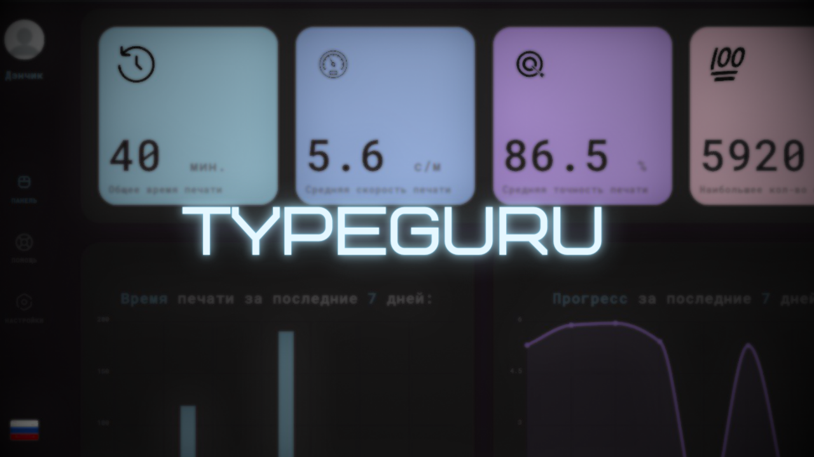
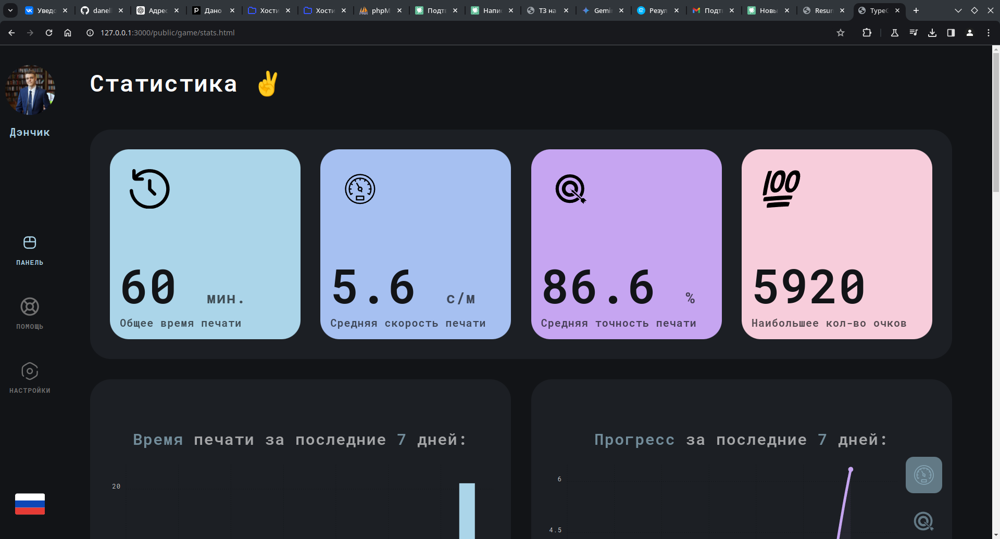
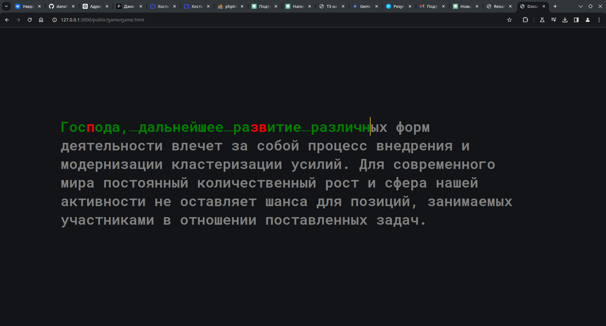

# Typeguru 👋

---
> *Пользователь печатает....*

       

# Typeguru

## О проекте

**Typeguru** — это веб-приложение для тренировки и развития ключевых навыков работы с текстом: **скорость**, **точность** и **выносливость**. Важное внимание уделяется не только скорости, но и качеству набора: приложение мотивирует пользователя стремиться к высокому уровню точности, при помощи системы оценивания каждой попытки, общей статистики и таблицы лучших попыток среди всех пользователей.     

## Для чего создан проект

Цель Typeguru — предоставить пользователям инструмент для улучшения навыков набора текста в условиях, максимально приближенных к реальным. В отличие от традиционных тренажеров, Typeguru фокусируется на текстах с пунктуацией и смысловой нагрузкой, что позволяет пользователям набирать тексты максимально приближенные к реальным, что положительно сказывается на навыке печати.     

## Технологии

- **Frontend**: HTML, CSS, SCSS, JavaScript
- **Backend**: Node.js, Express.js
- **Базы данных**: Для хранения пользовательской статистики
- **API**: Для интеграций и расширений

## Функционал

1. **Отслеживание статистики**: Пользователи могут видеть свою статистику, включая общее время, среднюю скорость, точность и количество набранных очков.

   

2. **Анализ результатов**: Приложение показывает детализированные данные по каждой попытке, что позволяет анализировать динамику и эффективность.

   

3. **Тренировка с осмысленными текстами**: Пользователи работают с предложениями, содержащими сложные конструкции и пунктуацию, что в свою очередь улучшает навыки печати реальных текстов.

   

## Возможности для пользователя

Пользователи могут:

- Печатать тексты и улучшать скорость и точность.
- Отслеживать свои достижения в виде статистики и графиков.
- Соревноваться в будущих многопользовательских режимах (в разработке).
- Получать подсказки и анализ ошибок для быстрого улучшения (в разработке).

## Возможности для расширения

Typeguru предоставляет множество возможностей для расширения:

1. **Многопользовательские соревнования**: Разработка режимов реального времени для совместного прохождения тренировок.
2. **Игровые механики**: Интеграция мини-игр для разнообразия процесса.
3. **Персонализация текстов**: Возможность настройки сложностей и тем.
4. **API для интеграции**: Возможность интеграции с другими образовательными платформами и корпоративными системами.

## Описание функциональных моделей        
* [functions.md](docs/functions.md)     
## Описание структурных моделей        
* [struct.md](docs/struct.md) 
## Поведенческие модели              
* [behaviour.md](docs/behaviour.md)     
## План тестирования              
* [descriptions.md](docs/descriptions.md)    
## Описание блочных тестов              
* [tests.md](docs/tests.md)    
