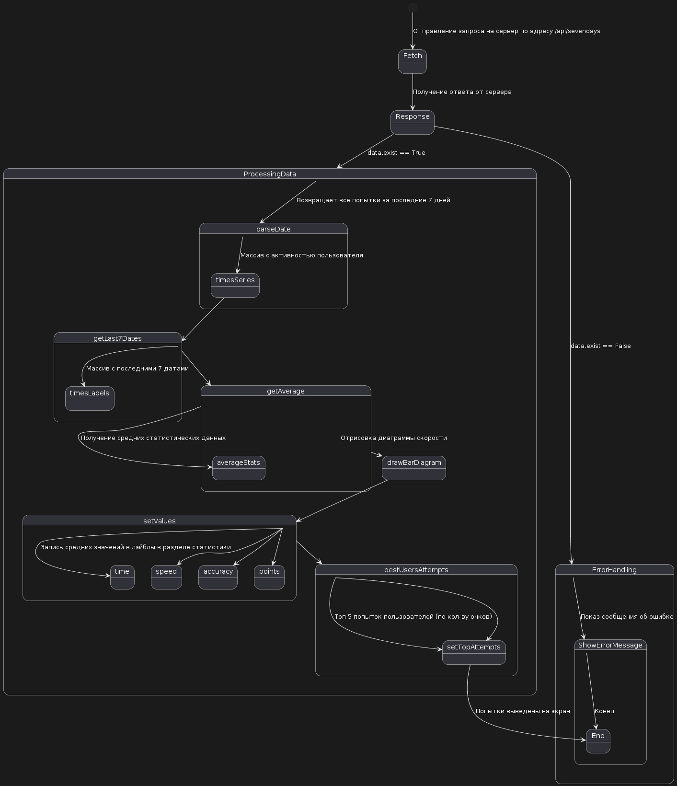
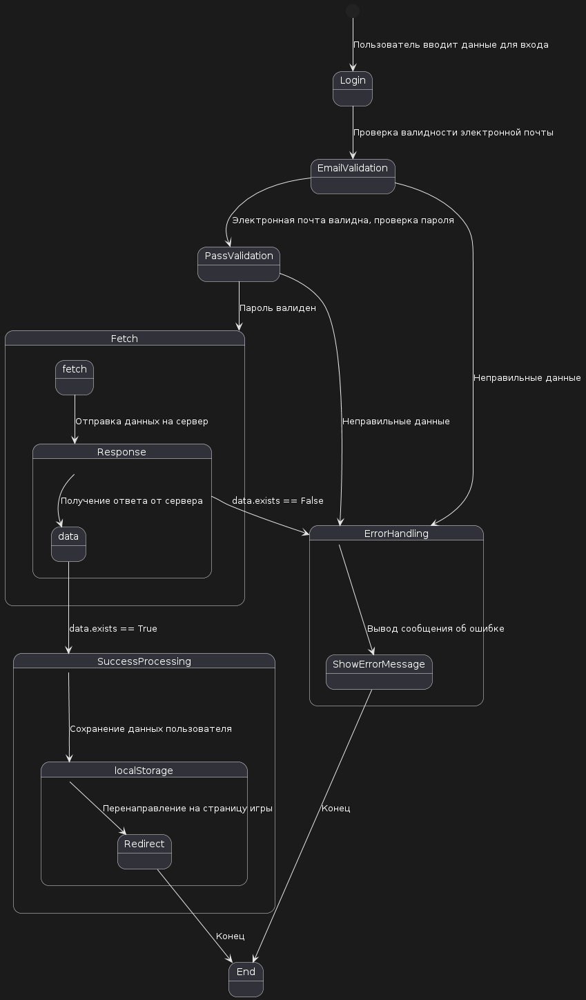
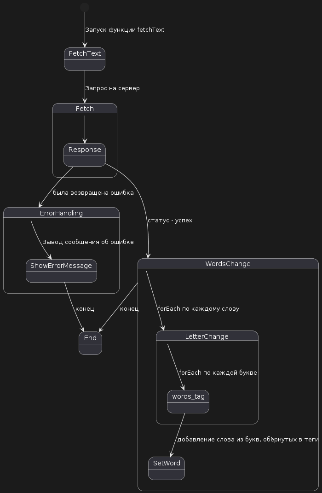

# Поведенческие модели 

## Диаграммы состояний        
Ниже приведены 3 диаграммы состояний: статистика, авторизация и         

### Статистика       

* [оффлайн файл](diagrams/state_diag1.puml)

Описание:      
Отправление запроса на сервер: Процесс начинается с отправки запроса на сервер по адресу /api/sevendays.      
Получение ответа от сервера: После отправки запроса система ждет ответа от сервера.      
Выбор дальнейших действий: В зависимости от содержимого ответа (data.exist), система принимает одно из двух направлений:      
Если data.exist == False, то система переходит к показу сообщения об ошибке.      
Если data.exist == True, то начинается обработка данных.      
Показ сообщения об ошибке: Если пользователь не существует, система отображает сообщение об ошибке и завершает процесс.      
Обработка данных: Если пользователь существует, система начинает анализ данных:      
parseDate: Возвращает все попытки за последние 7 дней.      
timesSeries: Создает массив с активностью пользователя.      
getLast7Dates: Генерирует массив с последними 7 датами.      
getAverage: Возвращает 4 поля данных для лэйблов в статистике     
drawBarDiagram: Отрисовывает диаграмму скорости.      
setValues: Записывает средние значения в лэйблы в разделе статистики.      
bestUsersAttempts: Определяет топ-5 попыток пользователей по количеству набранных очков.      
setTopAttempts: Отображает попытки пользователей на экране.      
Отрисовка диаграммы скорости: На этом этапе система генерирует диаграмму скорости, которая используется для визуализации статистической информации.      
Запись средних значений: Средние значения записываются в соответствующие лэйблы в разделе статистики.      
Определение лучших попыток: Система определяет топ-5 попыток пользователей, основываясь на количестве набранных очков.       
Отображение попыток на экране: После всех предыдущих операций, система отображает попытки пользователей на экране.        

### Авторизация       

* [оффлайн файл](diagrams/state_diag2.puml)

Описание:         
Пользователь вводит данные для входа - начальное состояние.          
Проверка валидности электронной почты и Пароль валиден - состояния, где проверяются введенные данные.       
Отправка данных на сервер - переход к отправке данных на сервер после успешной валидации.       
Получение ответа от сервера - ожидание ответа от сервера.       
Выбор дальнейших действий зависит от того, существует ли пользователь (data.exists == True или False). Если пользователь не существует, система переходит к Показу сообщения об ошибке. Если пользователь существует, начинается Успешное обработка данных.
Успешная обработка данных включает в себя Сохранение данных пользователя и Перенаправление на страницу игры.       
Конец - финальное состояние, достигаемое после успешной аутентификации или если произошла ошибка.       

### Получение текста с сервера

* [оффлайн файл](diagrams/state_diag3.puml)

Описание:       
Запуск функции fetchText: Процесс начинается с вызова функции fetchText.       
Запрос на сервер: Функция отправляет GET-запрос на сервер для получения текста.       
Получение ответа от сервера: После отправки запроса система ожидает ответа от сервера.       
Обработка ответа: В зависимости от статуса ответа:       
Если ответ содержит ошибку, система переходит к Выводу сообщения об ошибке.              
Если ответ успешен, оборачиваем каждое слово тег div и каждую букву в тег span            
Используем для этого метод forEach.       
После преобразования добавляем результат в html.        
Вывод сообщения об ошибке: Если при обработке ответа возникла ошибка, система выводит сообщение об ошибке.       
После успешной обработки текста или в случае возникновения ошибки процесс завершается.       