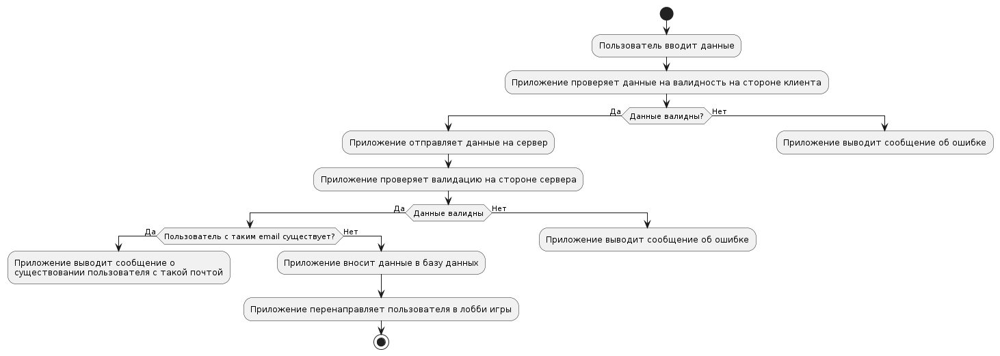

# Функциональные модели

## Диаграмма вариантов использования приложения     

* [оффлайн файл](diagrams/variants.puml)

## Регистрация
      
* [оффлайн файл](diagrams/regist.puml)      
Пользователь: вводит данные для регистрации (имя, почта, пароль, подтверждение пароля)
Приложение: 
    - проверяет введённые данные на валидность на стороне клиента
    - отправляет json файл с введёнными данными на сервер
    - проверяет валидацию на стороне сервера
    - если нет пользователя с таким email, то вносит данные в базу данных, иначе выводит сообщение об уникальности почты
    - перенаправляет пользователя в лобби игры

## Авторизация
      
* [оффлайн файл](diagrams/auth.puml)      
Пользователь: вводит данные для авторизации (почта, пароль)
Приложение: 
    - проверяет введённые данные на валидность на стороне клиента
    - отправляет json файл с введёнными данными на сервер
    - проверяет валидацию на стороне сервера
    - делает запрос к серверу, для проверки данных пользователя
    - в случае успеха, перенаправляет пользователя в лобби игры, иначе выводит сообщение о неправильных данных

## Главное меню игры
Пользователь: нажимает кнопку "играть" и переходит в режим игры
Приложение: перенаправляет пользователя на страницу с игрой

Пользователь: нажимает кнопку "статистика", и переходи в меню статистики
Приложение: перенаправляет пользователя на страницу со статистикой

Пользователь: нажимает на иконку личного кабинета
Приложение: открывает модальное окно с личными данными пользователя

## Личный кабинет
      
* [оффлайн файл](diagrams/lk.puml)      
Пользователь: вносит изменения в одно из полей данных
Приложение:
    - проверяет введённые данные на валидность на стороне клиента
    - отправляет json файл с введёнными данными на сервер
    - проверяет валидацию на стороне сервера
    - в случае успеха, обновляет данные пользователя
    - в личном кабинете выводит обновлённые данные

Пользователь: нажимает на переключатель музыки
Приложение: включает/выключает фоновую музыку

## Режим игры
      
* [оффлайн файл](diagrams/gm.puml)      
Приложение: 
    - делает GET запрос на сервер, чтобы получить текст
    - выводит текст на экран
Пользователь: начинает ввод текста
Приложение: 
    - проверяет правильность ввода текста
    - если буква введена верно, то подсвечивает её зелёным, иначе красным

Пользователь: вводит последний символ в тексте
Приложение:
    - проверяет этот символ на правильность и подсвечивает нужным цветом
    - выводит статистику о завершённой попытке на экра
    - отправляет данные о завершённой попытке на сервер

Пользователь: нажимает кнопку "играть дальше"
Приложение: начинает игру с начала

Пользователь: нажимает кнопку "вернуться в главное меню"
Приложение: перенаправляет пользователя в главное меню

## Меню статистики
      
* [оффлайн файл](diagrams/stats.puml)      
Приложение: подгружает статистику пользователя с сервера и выводит её на экран
Пользователь: нажимает "показать все попытки"
Приложение: 
    - делает запрос к серверу, чтобы получить все попытки
    - выводит на экран список всех попыток с их статистикой
Пользователь: выбирает временной диапазон завершённых попыток
Приложение: 
    - делает запрос к серверу, чтобы получить все попытки из указанного диапазона
    - выводит на экран список всех отфильтрованных попыток с их статистикой 
    
