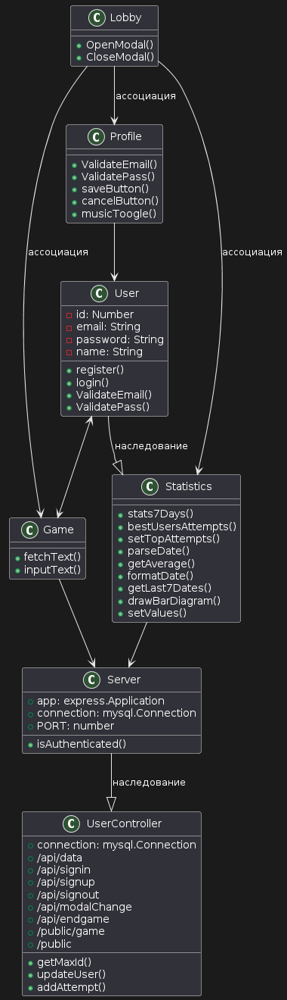
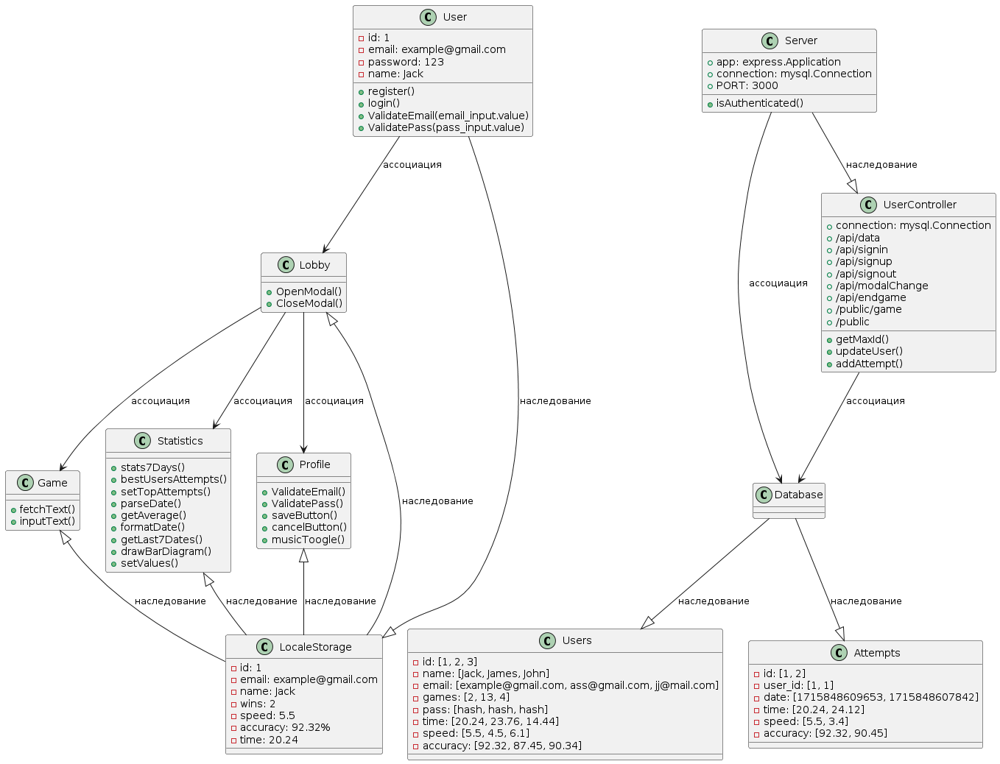

# Структурные модели

## Диграмма классов         

* [оффлайн файл](diagrams/classes.puml)

Описание диаграммы:      
Классы, описанные в этой диаграмме, выполняют следующие функции.        

### Классы:

User: Представляет отдельных пользователей системы. Он включает атрибуты, такие как id, email, password и name. Методы, такие как register(), login(), ValidateEmail() и ValidatePass(), используются для процессов аутентификации и проверки пользователей.        
Game: Обрабатывает функциональности, связанные с игрой. У него есть методы, такие как fetchText() и inputText(), для взаимодействия с контентом игры.        
Statistics: Управляет статистическими данными, связанными с деятельностью пользователей за период в 7 дней. Она включает методы для расчета средних значений, установки лучших попыток, разбора дат, форматирования данных и создания столбчатых диаграмм.        
Profile: Занимается управлением профилем пользователя, включая проверку электронной почты и пароля (ValidateEmail() и ValidatePass()), сохранение изменений (saveButton()), отмену изменений (cancelButton()) и переключение музыки (musicToggle()).        
Lobby: Контролирует функциональности лобби, такие как открытие и закрытие модальных окон (OpenModal() и CloseModal()).        
Server: Представляет компонент серверной части приложения, обрабатывающий Express.js приложения (express.Application), соединения с MySQL (mysql.Connection), конфигурации портов (PORT) и проверки аутентификации (isAuthenticated()).        
UserController: Действует как контроллер для конечных точек API, связанных с пользователями, и публичных ресурсов. Он управляет соединениями с базой данных, обрабатывает различные маршруты API (например, /api/data, /api/signin, /api/signup и т.д.) и предоставляет методы для обновления данных пользователя, добавления попыток и получения максимального идентификатора.        
         
### Ассоциации:        
Lobby связан с Game, Statistics и Profile.        
Game подключен к Server.        
Statistics связана с Server.        
Profile связан с User.        
User имеет двунаправленное отношение с Game и наследуется от Statistics.        
Server является суперклассом UserController, указывая на наследование.         

## Диграмма объектов       
      
* [оффлайн файл](diagrams/objects.puml)      

Описание каждого классов, сущностей и ассоциаций между ними.       

### Классы: 
User: Представляет отдельных пользователей системы. Он включает атрибуты, такие как id, email, password и name. Методы, такие как register(), login(), ValidateEmail() и ValidatePass(), используются для процессов аутентификации и проверки пользователей.        
Game: Обрабатывает функциональности, связанные с игрой. У него есть методы, такие как fetchText() и inputText(), для взаимодействия с контентом игры.        
Statistics: Управляет статистическими данными, связанными с деятельностью пользователей за период в 7 дней. Она включает методы для расчета средних значений, установки лучших попыток, разбора дат, форматирования данных и создания столбчатых диаграмм.        
Profile: Занимается управлением профилем пользователя, включая проверку электронной почты и пароля (ValidateEmail() и ValidatePass()), сохранение изменений (saveButton()), отмену изменений (cancelButton()) и переключение музыки (musicToggle()).        
Lobby: Контролирует функциональности лобби, такие как открытие и закрытие модальных окон (OpenModal() и CloseModal()).        
LocaleStorage (сущность): Хранит локальные данные пользователя, такие как имя, электронная почта, количество побед, скорость и точность.         
Server: Представляет компонент серверной части приложения, обрабатывающий Express.js приложения (express.Application), соединения с MySQL (mysql.Connection), конфигурации портов (PORT) и проверки аутентификации (isAuthenticated()).        
Database: Пустой класс, указывающий на место, где будут происходить взаимодействия с базой данных, хотя конкретные детали его реализации не предоставлены в этой диаграмме.        
Users и Attempts (сущности): Таблицы в базе данных, которые хранят информацию о пользователях и их попытках соответственно.         
UserController: Действует как контроллер для конечных точек API, связанных с пользователями, и публичных ресурсов. Он управляет соединениями с базой данных, обрабатывает различные маршруты API (например, /api/data, /api/signin, /api/signup и т.д.) и предоставляет методы для обновления данных пользователя, добавления попыток и получения максимального идентификатора.        

### Ассоциации:         
Profile связан с User, что позволяет сохранять и управлять данными профиля пользователя.
Statistics наследуется от User, позволяя агрегировать данные по всем пользователям.
Game связана с User и Server, обеспечивая взаимодействие между игровым процессом и серверными ресурсами.
Lobby связано с Game, Statistics и Profile, управляя интерфейсом игры и его элементами.
Server связан с Database и UserController, обеспечивая доступ к данным и обработку запросов.        